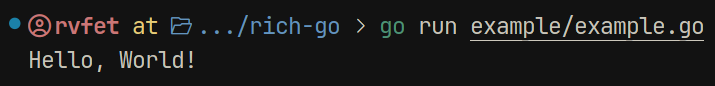
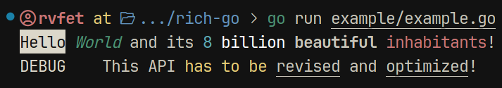
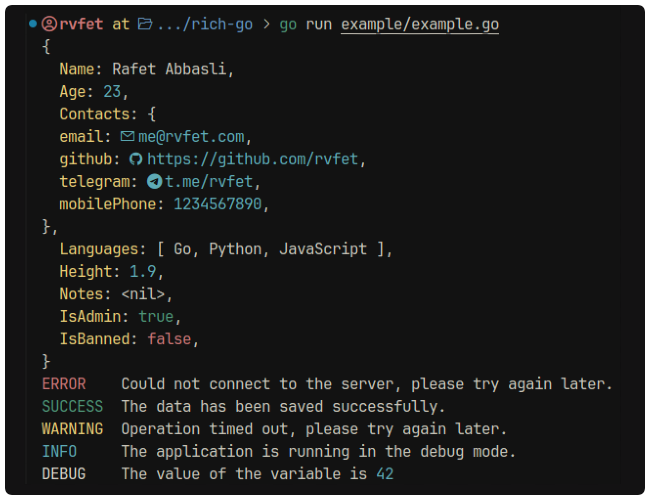

<h1 align=center>🎨 Rich-go</h1>

<p align=center></p>

Rich-go is a Go library for printing text in terminal in a more readable and eye-pleasing way. This library is meant to be a Go equivalent of the Python library [Rich](https://github.com/Textualize/rich) by Textualize.

> **Note**: This library is still in development and is not yet ready for production use.

## 🚀 Getting Started

### Installation

To install Rich-go, you just need to `go get` it:

```bash
go get github.com/rvfet/rich-go
```

### Usage

Rich-go aims to be as simple as possible to use. Here is a simple example:

```go
package main

import (
  "github.com/rvfet/rich-go"
)

func main() {
  rich.Print("Hello, World!")
}
```



Common logging functions are also available:

```go
package main

import (
  "github.com/rvfet/rich-go"
)

func main() {
  rich.Info("Connecting to database...")
  rich.Warning("Connection timed out, retrying...")
  rich.Error("Connection failed!")
  rich.Success("Connection successfully established!")
  rich.Debug("Connection took 2.5s")
}
```


Rich-go also supports inline styles, arguments and nesteding. Here's a crazy example:

```go
package main

import (
  "github.com/rvfet/rich-go"
)

func main() {
	rich.Print("[x]Hello[/] [green][i]World[/] and its", 8, "[white]billion[/] [b]beautiful[/] [red]inhabitants[/]!")
	rich.Debug("This API [yellow]has to be[/yellow] [u]revised[/u] and [u]optimized[/u]!")
}
```



> **Note**: For icons to work, you need to have a font that supports them. You can use the [Nerd Fonts](https://www.nerdfonts.com/) for this.

### For real-world usage example and quickly getting started, check out the [Example](/example/example.go) code.



---

### 📦 Roadmap

- [x] Basic text printing
- [x] Basic logging functions
- [x] Inline styles
- [x] Making Print and logging functions variadic
- [ ] Handling nested styles in a better way
- [ ] Implementing string formatting:
      `rich.Print("Hello, %s!", name)` or `rich.Print("Hello, {name}!")`
- [ ] Making monkey-patching easier and improving modularity
- [ ] Perhaps, a docs website?
- [ ] Config file for customizing styles
- [ ] Logging to file

---

### 🤝 Contributing

Contributions are always welcome! Feel free to open issues or pull requests.

### 📦 Built With

- [Go](https://golang.org/) - The Go Programming Language
  And it's standard libraries.

### 📧 Contact

If you have any questions or suggestions, feel free to contact me at [me@rvfet.com](mailto:me@rvfet.com).
